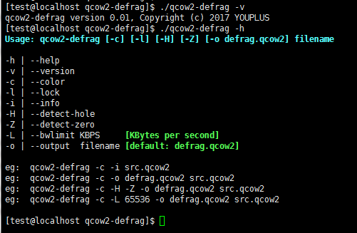
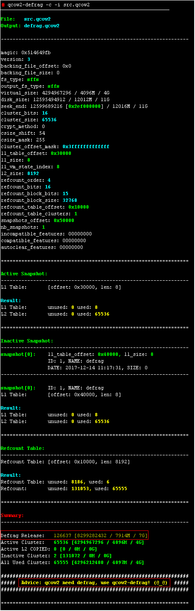
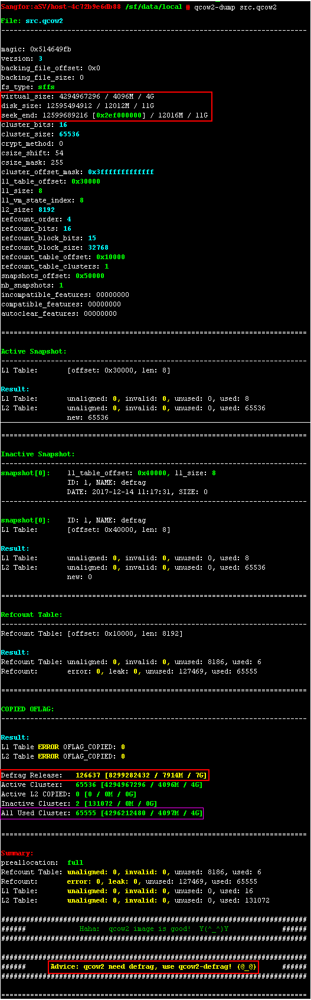
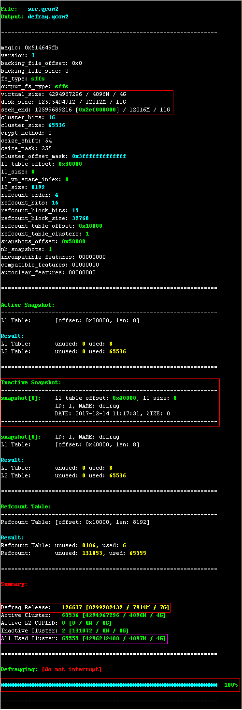

qcow2-defrag
=========================================================================

Copyright (c) 2017 YOUPLUS

Author: YOUPLUS(<zhang_youjia@126.com>)

qemu-img convert command(eg: qemu-img convert -f qcow2 -o preallocation=off -O qcow2 src.qcow2 dst.qcow2) will lost snapshots of qcow2 image. qcow2-defrag is a tool for defragging qcow2 image which can solve this problem.

## Compile
`gcc -g -O2 -o qcow2-defrag fs_magic.h qcow2_defrag.h qcow2_defrag.c`

## Usage
`qcow2-defrag [opts] <qcow2_image>`

## Examples

